# 一、系统说明

基于springboot+vue+elementui开发的医院信息管理系统,系统功能齐全, 代码简洁易懂，适合小白学编程。

# 二、系统架构

######      前端：vue| elementui

######      后端：springboot | mybatis 

######      环境：jdk1.8+ | mysql8.0+ | maven

# 三、代码及数据库

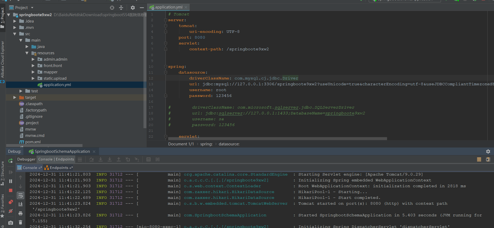

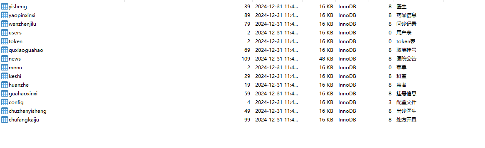

# 四、相关功能介绍

#### 1).客户端

###### 1.登录

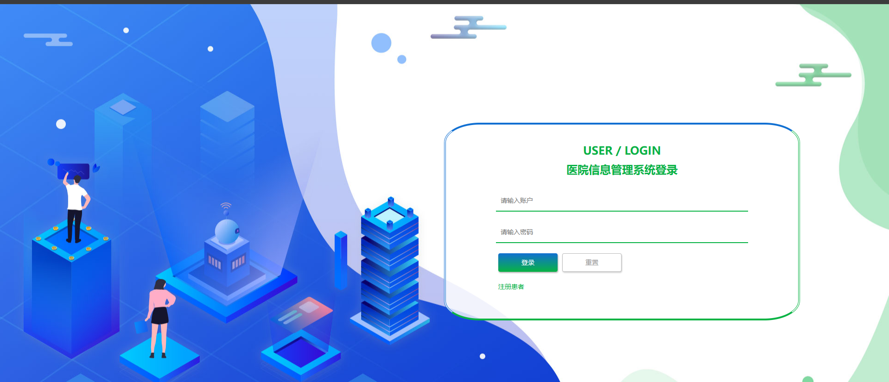

###### 2.患者注册

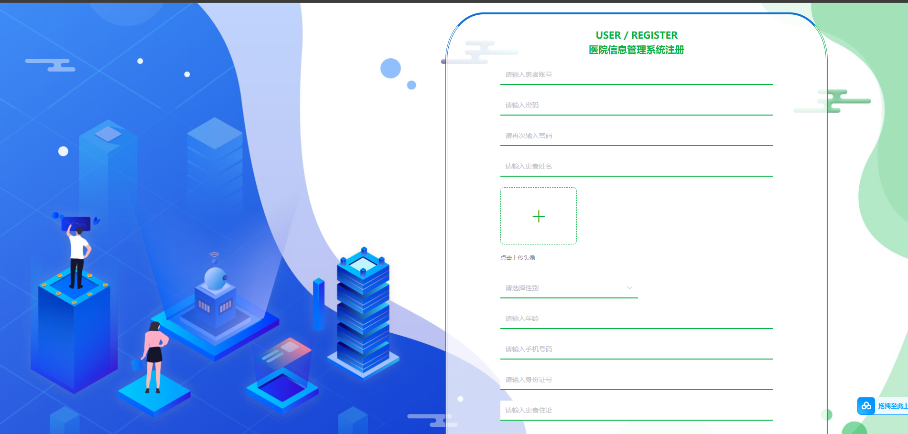

###### 3.首页

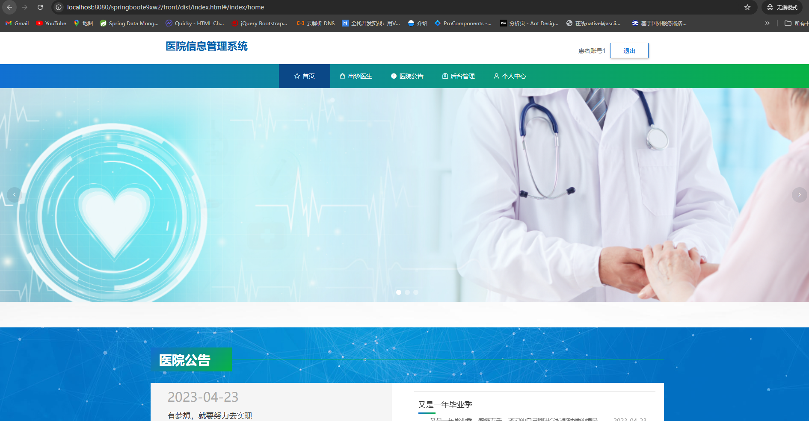

###### 4.出诊医生

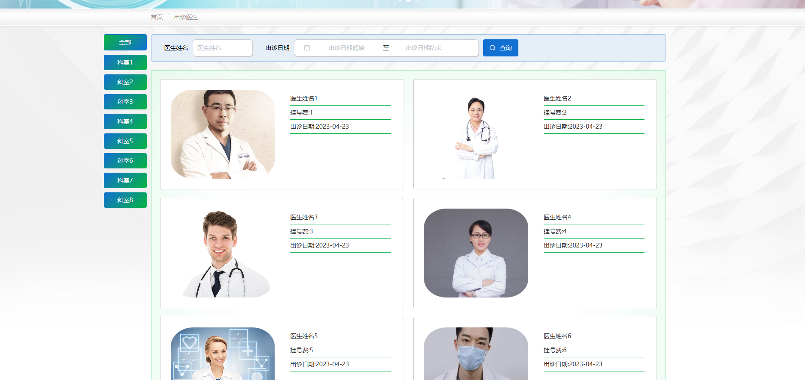

###### 5.医院公告

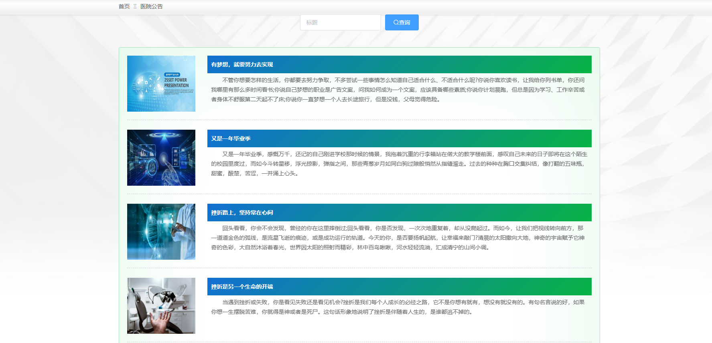

###### 6.个人中心

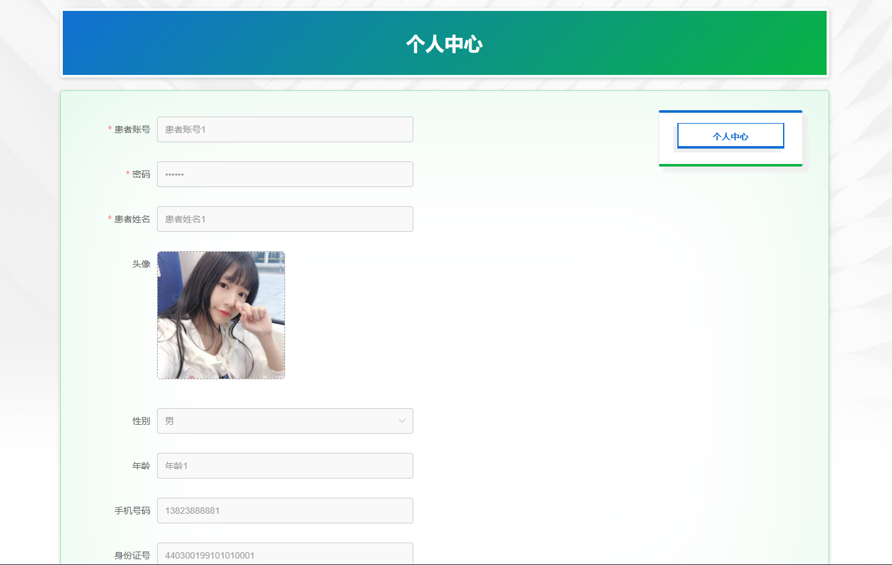

#### 2).管理端

###### 1.登录

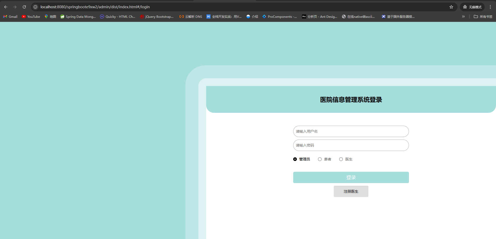

###### 2.注册医生

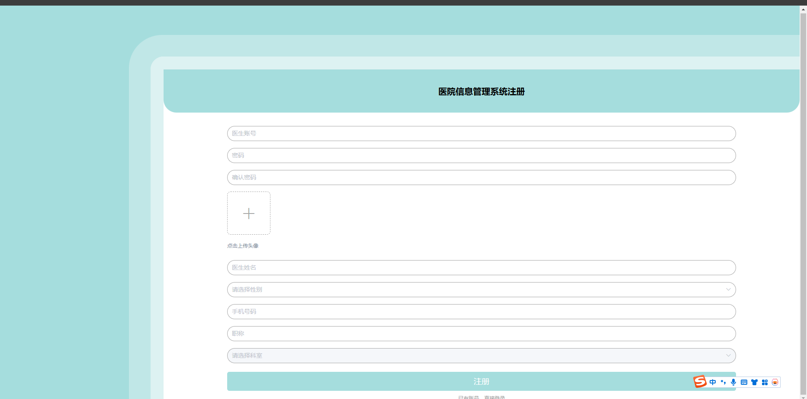

###### 3.个人中心->修改密码

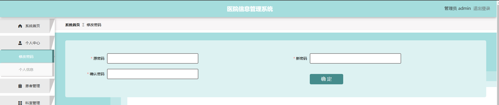

###### 4.患者管理

包含:删除、修改、新增、详情功能

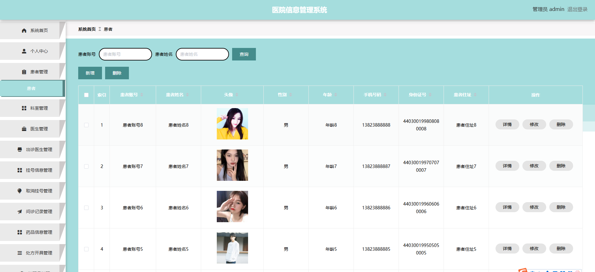

###### 5.科室管理

包含:删除、修改、新增、详情功能

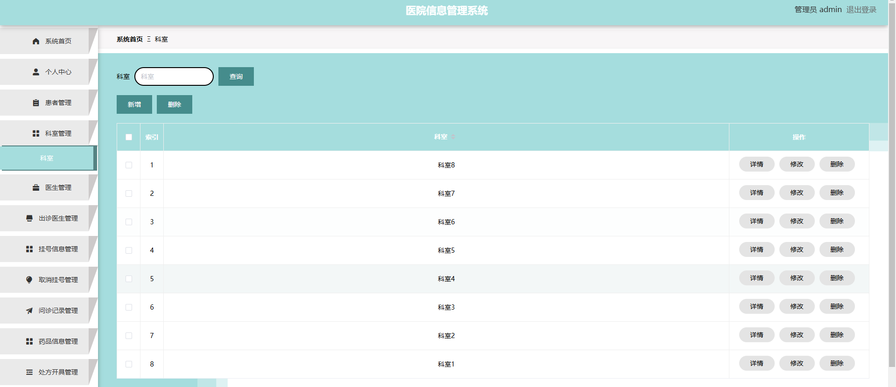

###### 6.医生管理

包含:删除、修改、新增、详情功能

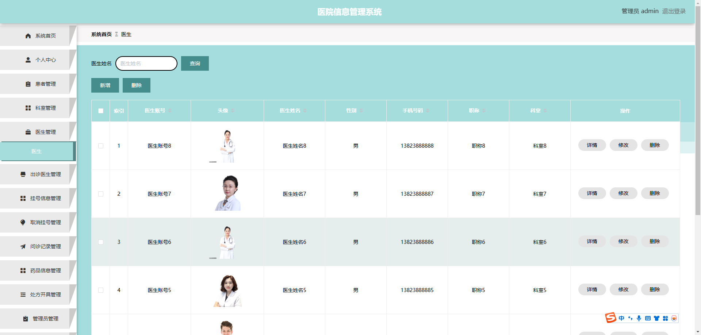

###### 7.出诊医生管理

包含:删除、详情、新增、修改功能

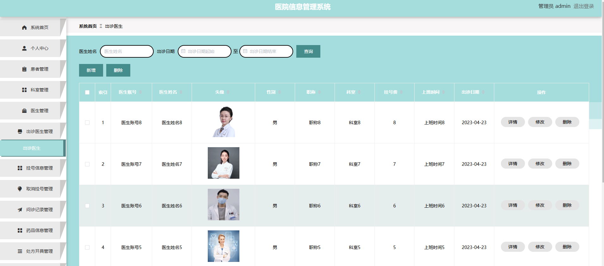

###### 8.挂号信息管理

包含:删除、详情、新增、修改功能

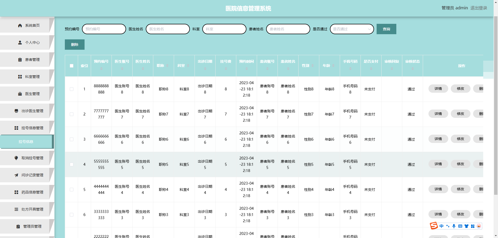

###### 9.取消挂号管理

包含:删除、详情、新增、修改功能

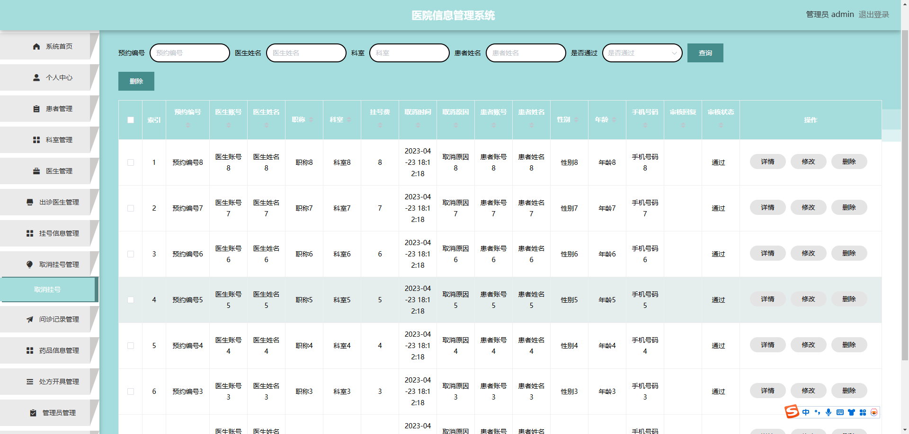

###### 10.问诊记录

包含:删除、详情、新增、修改功能

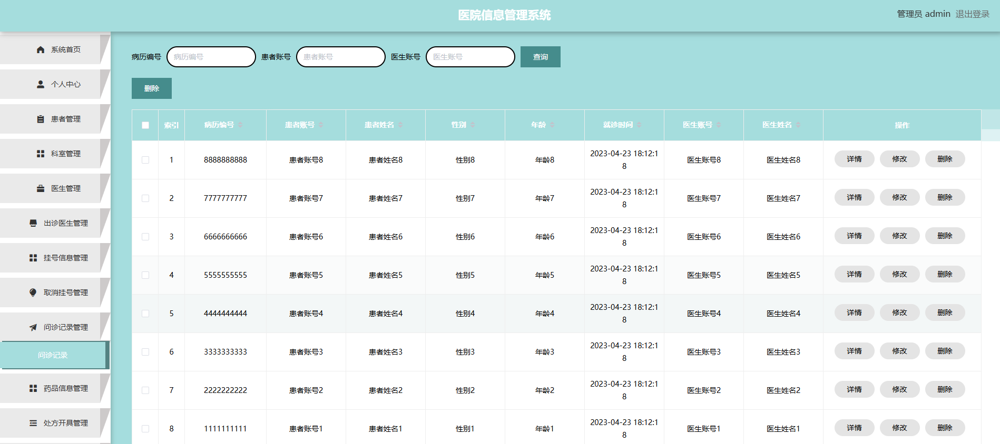

###### 11.药品管理

包含:修改、详情、删除、新增功能

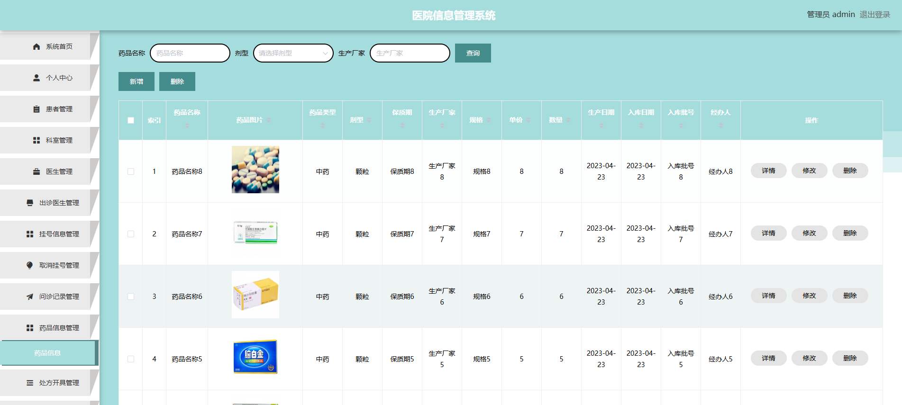

###### 12.处方开具

包含:修改、详情、删除、新增功能

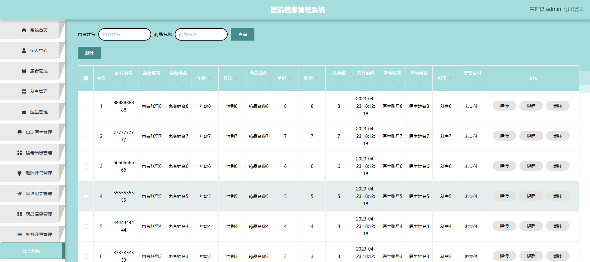

###### 13.管理员管理

包含:修改、详情、删除、新增功能

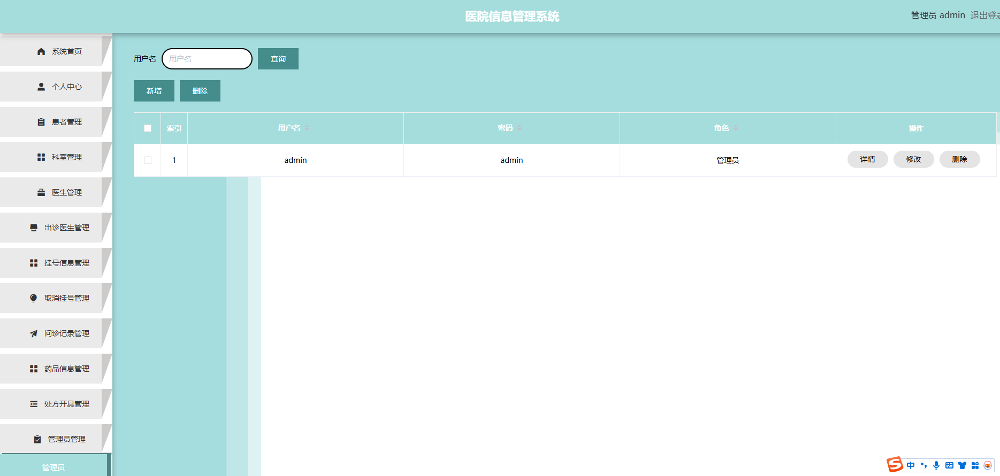

###### 14.医生端登录

注:功能与管理员差不多，数据权限不一样

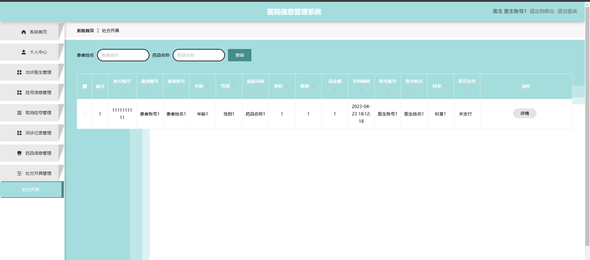

######
